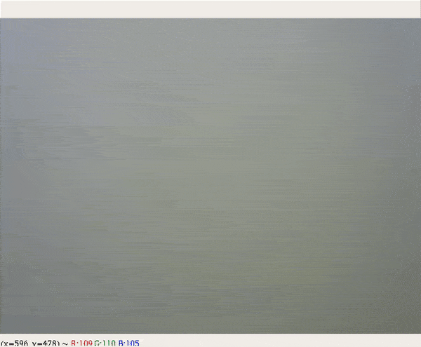
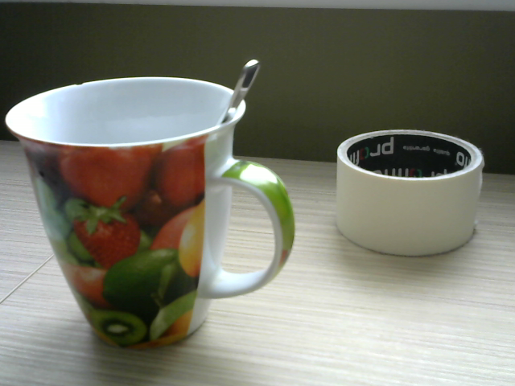
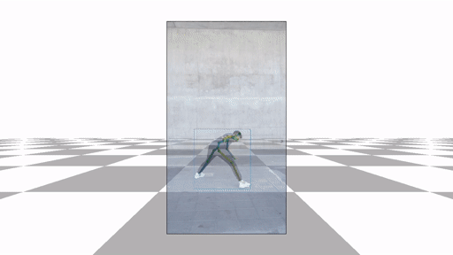

# Human pose estimation with distance measurement relative to ArUco marker.
## Environment setup
Recomended 
* Python 3.8
* GPU with 4Gb memory
* CUDA 11.3

Environment setup script:
```
python -m venv env
. env/bin/activate
pip install -r requirements.txt
pip install torch==1.10.2+cu113 torchvision==0.11.3+cu113 torchaudio==0.10.2+cu113 -f https://download.pytorch.org/whl/cu113/torch_stable.html
git clone https://github.com/isarandi/poseviz.git
cd poseviz
pip install .
cd ../
rm -rf poseviz/
```

To launch project: `python main.py`  
You can change main settings in `config.yaml` file. For example you can turn on or off separate module.

## Project description
It consist of 3 parts:
* ArUco marker detector
* Depth estimation
* 3D and 2D human pose estimator

## ArUco marker detector
The code is well described [here](https://github.com/4ku/Human-pose-estimation-for-robot-collaboration/tree/master/modules/aruco)  
This module detect ArUco markers and calculate distance to them.  


## Depth estimator
Get depth map from single image. Depth estimator based on [MiDaS](https://github.com/isl-org/MiDaS) approach. Models was taken from the MiDaS [PyTorch Hub](https://pytorch.org/hub/intelisl_midas_v2/).  




## Pose estimation
Estimates human position in 2D and 3D spaces. Approach was based on [MeTRAbs](https://github.com/isarandi/metrabs) solution. Full documentation is available [here](https://github.com/isarandi/metrabs/tree/master/docs).

