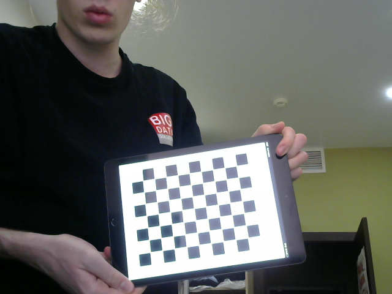

# ArUco markers

* __aruco_generator.py__ - Generate ArUco marker with specific ID in folder `ArUco_markers`.

  Usage example:  `python aruco_generator.py --id 0 --marker_size 4 --total_markers 50 --pixel_size 700`  
  For more imformation type: `python aruco_generator.py --help`  
  
* __camera_calibration.py__ - Callibration camera script. Starts a video stream from camera to collect
    data for callibration until n frames are collected or `d` button is pressed.
    
  Usage example:  `python camera_calibration.py --number_of_squares_x 10 --number_of_squares_y 8 --square_size 0.016 --number_of_frames 100 --pick_every 3 --display_images 0`  
  For more imformation type: `python camera_calibration.py --help` 

* __intrinsic_params.yaml__ - contains camera distortion vector and calibration matrix.

* __aruco_detector.py__ - contains a class `ArucoDetector` and can be imported as a module.  
  This class can detect ArUco markers and it's ID and calculates it's distance and orientation with respect to camera.  
  Also can be run as a separate script in real-time with camera.  
  All the information about markers is aslo being logged to __logfile.log__ file.

* __logfile.log__ - Log file with ArUco detections. This is a result of work __aruco_detector.py__ script. Structure of the log:

    1) № of frame
    2) Marker ID
    3) Distance to the camera
    4) Roll_x
    5) Pitch_y   
    6) Yaw_z

## ArUco marker example

  

## Camera calibration data example 

## ArUco detector example 
